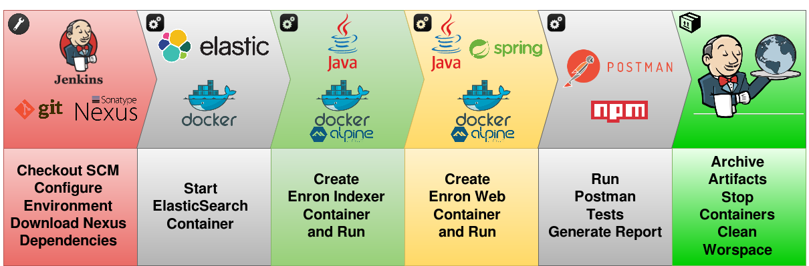

# Enron Test Pipeline #

 

## Overview

The Proposal's main idea is to build and provide a real runtime environment allowing a full integration test.  
Using Jenkins with Docker Pipeline we are able to build and use Docker containers from pipelines Groovy scripting.

 

## Dockerized CI environment

 

## Main Steps

  

 

## Steps

1. Get from **SCM** Pipeline configuration and artifacts
2. Get from **Nexus** latest version of _Enron\_Indexer_ and _Enron\_Web_
3. Pull image _elasticsearch:2.4.5-alpine_ and run **ElasticSearch** Container 
4. Create image _enron\_indexer_ with Dockerfile based on _openjdk:8-jre-alpine_
5. Run image _enron\_indexer_ and import _enron.json_ data 
6. Stop and remove image _enron\_indexer_ and print logs 
7. Create image _enron\_web_ with Dockerfile based on _openjdk:8-jre-alpine_
8. Run **Postman** tests
9. Archive test report
10. Waiting for user input to finish
11. Clean workspace
12. Stop and remove image _enron\_web_ and print logs
13. Stop and remove image _elasticsearch:2.4.5-alpine_

 

## Pipeline Parameters

    

  

## Pipeline Overview

    

  

## Postman Report

    
